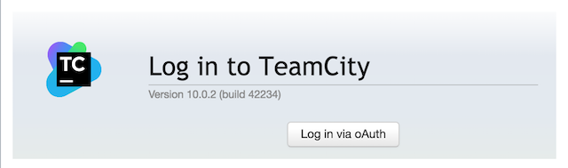
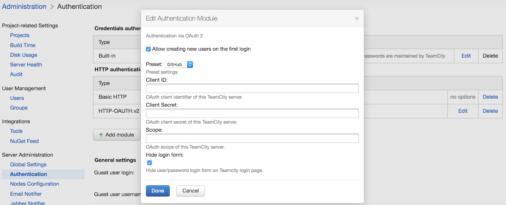

= teamcity-oauth image:https://api.bintray.com/packages/pwielgolaski/generic/teamcity-oauth/images/download.svg[link="https://bintray.com/pwielgolaski/generic/teamcity-oauth/_latestVersion"]

oAuth2 authentication plugin 



= Installation

Grab latest version of plugin from link image:https://api.bintray.com/packages/pwielgolaski/generic/teamcity-oauth/images/download.svg[link="https://bintray.com/pwielgolaski/generic/teamcity-oauth/_latestVersion"]
and install it to Teamcity following https://confluence.jetbrains.com/display/TCD10/Installing+Additional+Plugins[https://confluence.jetbrains.com/display/TCD10/Installing+Additional+Plugins]

= Configuration

Plugin support authentication using:

* GitHub
* Bitbucket
* Google
* Azure Active Directory
* any custom oAuth server

Login as administrator and go to Administration &gt; Authentication

Switch to advanced mode and add module HTTP-OAUTH.v2.



You need to specify your client id, client secret and scope.

== Github
If you want to use GitHub you need an application to be created https://github.com/settings/applications/new[https://github.com/settings/applications/new]. `Authorization callback URL` should be homepage of TeamCity.

You should use the `user` scope for github

== Bitbucket
You should use the `account` scope for Bitbucket

== Google
You should use the `profile email` scope for Google

== Azure
You should create an application in Azure: https://apps.dev.microsoft.com[https://apps.dev.microsoft.com]. You need to set `Redirect URLs` to the homepage of TeamCity.

You should use the `openid https://graph.microsoft.com/user.read` scope for Azure

Note that by default, _any_ Microsoft live account can register with OAuth. To restrict this to a specific Active Directory instance, (find your tenant ID)[https://support.office.com/en-us/article/find-your-office-365-tenant-id-6891b561-a52d-4ade-9f39-b492285e2c9b], select `Preset: Custom` and use the following endpoints:

```
Authorization: https://login.microsoftonline.com/{tenantId}/oauth2/v2.0/authorize
Token: https://login.microsoftonline.com/{tenantId}/oauth2/v2.0/token
User: https://graph.microsoft.com/v1.0/me
```

If you don't enable "Allow creating new users on the first login" only users that already exist in Teamcity can login.
It means that you need account with the same name as user login name in oauth.

If you specify an "Email Domain", only users whose email is at that domain will be able to log in.

If you specify a value in "Organizations", only users with the specified organizations will be authenticated. You can specify more than one organization by separating them with a comma.

You can decide if you want to hide user/password form on login screen (worth leaving unchecked when you test it).

You can consider to disable also "Allow user registration from the login page" in "Built-in" module.

Save and test out.

Login at your Teamcity host.

= Development

Plugin can be build and deployed by `gradle deployToTeamcity`

Teamcity instance for testing can be setup by `docker-compose up`
